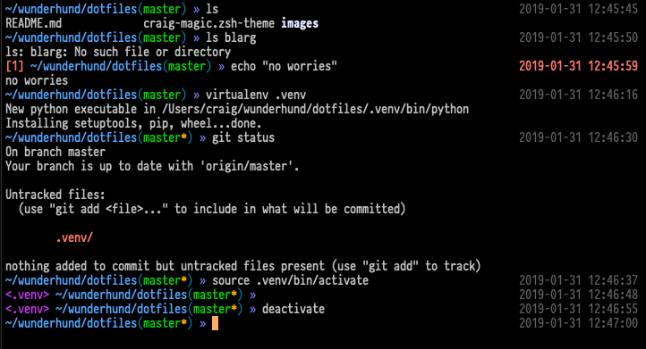

# dotfiles
miscellaneous user environment files I use

## craig-magic.zsh-theme

A ZShell theme I modified for my personal use. Primarily ripped off from the [af-magic.zsh-theme](https://github.com/andyfleming/oh-my-zsh) by andyfleming. ISO date formatting taken from the [bira-date](https://gist.github.com/asimihsan/5277137) by asimihsan.



### Installation

1. [Install Oh-My-Zsh](https://github.com/robbyrussell/oh-my-zsh/wiki/Installing-ZSH)
2. Download craig-magic.zsh-theme and save it in `~/.oh-my-zsh/themes/`:
```
wget https://raw.githubusercontent.com/wunderhund/dotfiles/master/craig-magic.zsh-theme -O ~/.oh-my-zsh/themes/craig-magic.zsh-theme
```
3. Open `~/.zshrc` in a text editor of your choice.
    * Find the line with `ZSH_THEME=` and replace it with `ZSH_THEME="craig-magic"`
        * Or use this `sed` command to replace it:
    ```
        sed -i".orig" 's/ZSH_THEME=".*"/ZSH_THEME="craig-magic"/' ~/.zshrc
    ```
    * Find the `plugins=( )` array and add `virtualenv` to it (if you use virtualenv).
4. Save and exit your text editor.
5. Run `source ~/.zshrc` to reload your shell.
6. Enjoy!

